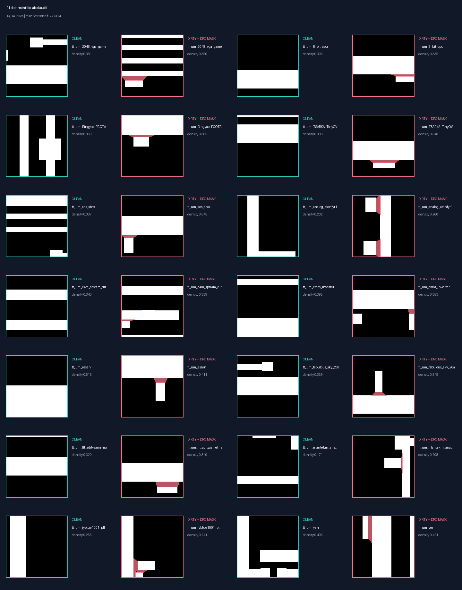

# Autonomous DRC Dataset Generation & CNN Inference Pipeline

This project provides an end-to-end workflow for **Machine-Learning-based Design Rule Check (DRC)** on Sky130 layouts. It:

1. Extracts Metal 1 (M1) from real layouts
2. Injects synthetic **m1.2 spacing** violations
3. Runs KLayout DRC and builds labeled training tiles
4. Trains a CNN (Google Colab)
5. Runs fast ONNX inference on a PC with Grad-CAM localization and GDS output

The research goal is to improve on the paper's tile-level clean/dirty
classifier in three measurable ways: preserve competitive classification,
demonstrate generalization to unseen layout families, and progress from coarse
tile localization to exact violation geometry and verified repair proposals.

> **Project status:** **B0** through **B6.1** are complete. B2 established
> reproducible three-seed baselines with the unchanged `NCSU_DRCNN`: **92.47%
> +/- 0.61%** accuracy on the leakage-aware tile-random reference and **90.38%
> +/- 0.84%** on layout-family-disjoint test data. B3 found no accepted
> replacement: calibrated thresholds raised unseen-layout dirty recall to
> **94.42%**, but accuracy fell to **89.71%**, beyond the predeclared tolerance.
> B4's compact model then raised validation dirty F1 to **93.61%** and used
> **14.3x fewer parameters**, but frozen unseen-layout accuracy/F1 fell to
> **89.36% / 90.36%**. B2 therefore remains the frozen classifier baseline.
> B5's validation-selected 25% B2 / 75% B4 ensemble improved unseen-layout
> dirty F1 to **91.25%**, but tile-reference recall fell from **93.39%** to
> **92.07%**, beyond the frozen tolerance. B5.2 then closed classifier-only
> tuning. B6.1 now provides gap-free, vector-backed localization data across 14
> families: **6,924 exact violations**, **8,021 dirty + 8,021 clean tiles**, and
> one unique owner for every exact violation. B6.2 multi-task U-Net training is
> next; exact-coordinate recovery and verified repairs remain the end goal.
> Do not treat the generated CNN report as a replacement for sign-off DRC.

**Repository:** https://github.com/nocleo/ADVLSI2_Project_updated

See [MODEL_ROADMAP.md](MODEL_ROADMAP.md) for the benchmark acceptance criteria
and the controlled improvement phases planned after B0.

---

## Table of Contents

- [Project Structure](#project-structure)
- [Prerequisites](#prerequisites)
- [Current Benchmark — B0](#current-benchmark--b0)
- [Evaluation Strategy](#evaluation-strategy)
- [Quick Start — Full Flows](#quick-start--full-flows)
- [Part 1: Training Data Pipeline](#part-1-training-data-pipeline-generate_training_dataset_scripts)
- [Part 2: Google Colab (Training & Basic Inference)](#part-2-google-colab-colab_code_backup)
- [Part 3: PC Inference — Optimized](#part-3-pc-inference--optimized-run_inference_pc_optimized)
- [Part 4: PC Inference — PyTorch (Non-Optimized)](#part-4-pc-inference--pytorch-run_inference_pc)
- [End-to-End Inference Flow](#end-to-end-inference-flow)
- [Output Directory Layout](#output-directory-layout)
- [Configuration Reference](#configuration-reference)
- [Function Reference](#function-reference)

---

## Project Structure

```
ADVLSI2_Project_updated/
├── project_paths.py               # Portable path helpers (project root)
├── generate_training_dataset_scripts/      # Training dataset generation pipeline
├── run_inference_pc_optimized/    # Fast PC inference (ONNX + pipelined tiling)
├── run_inference_pc/              # Simpler PC inference (PyTorch, no ONNX)
├── Colab_Code_backup/             # Google Colab notebook cells (train + infer)
├── notebooks/                     # Colab notebooks, including the U-Net experiment
├── notebooks/B2_Dual_Baselines.ipynb # Resume-safe Colab launcher for B2
├── notebooks/B3_Training_Optimization.ipynb # Resume-safe B3 Colab launcher
├── notebooks/B4_Compact_Architecture.ipynb # Resume-safe B4 Colab launcher
├── notebooks/B5_Ensemble.ipynb    # Validation-gated B2/B4 ensemble launcher
├── notebooks/B5_2_Failure_Slice_Audit.ipynb # Train/validation error audit
├── notebooks/B6_1_Localization_Dataset.ipynb # Resume-safe B6.1 dataset launcher
├── training/train_classifier.py   # Reproducible baseline CNN training CLI
├── training/classifier_models.py  # Frozen baseline and B4 architecture registry
├── training/calibrate_classifier_threshold.py # Validation-only B3 threshold selection
├── training/evaluate_classifier.py # Test-only evaluation after B3 selection
├── training/dataset_manifest.py   # B1 integrity audit and frozen split logic
├── data/layout_registry.json      # Pinned source, family, license, and generation metadata
├── data/evaluation_protocols.json # Frozen tile-random and unseen-layout protocols
├── scripts/acquire_b1_layouts.py  # Acquire/verify the selected open layouts
├── scripts/build_dataset_manifest.py # Produce versioned manifests and summaries
├── scripts/run_b2_benchmarks.py   # Run/aggregate both B2 protocols over fixed seeds
├── scripts/run_b3_optimization.py # Validation-only B3 search and test confirmation
├── scripts/run_b3_extension.py    # Scheduler, early stopping, threshold calibration
├── scripts/run_b4_architecture.py # Validation-gated compact architecture experiment
├── scripts/run_b5_failure_audit.py # Path-aligned B2/B4 failure-slice analysis
├── scripts/build_b6_localization_dataset.py # Registry-wide exact-mask builder
├── scripts/benchmark_classifier_architectures.py # Paired CPU/ONNX cost benchmark
├── scripts/verify_classifier_flow.py # Fast dataset→train→ONNX→inference check
├── results/b2_baselines/          # Accepted B2 aggregate and six run-metric JSONs
├── results/b3_optimization/       # B3 aggregate, calibration, and frozen-test evidence
├── results/b4_architecture/       # B4 aggregate, paired cost evidence, and decision
├── results/b5_ensemble/           # B5 probability blend evidence and rejection decision
├── results/b6_localization_dataset/ # B6.1 compact geometry/dataset result
├── real_layouts_tt/               # Input .oas layout files
├── training_datasets/             # Training pipeline data per layout (generated locally)
├── inference_results/             # Inference pipeline results per layout (generated locally)
├── sky130_drc_deck/               # KLayout DRC rule deck (run_drc_full.lydrc, sky130A_mr.drc)
├── .gitignore                     # Excludes generated outputs and local artifacts
├── ncsu_drcnn_weights.pth         # Trained model weights (after Colab training)
└── ncsu_drcnn.onnx                # Exported ONNX model (after export_to_onnx.py)
```

All local scripts resolve paths from **`project_paths.py`**, which anchors everything to the repository root. You can run scripts from any working directory on any machine.

---

## Prerequisites

| Component | Purpose |
|---|---|
| **Python 3.x** | All scripts |
| **KLayout** | Layout I/O, DRC, geometric checks |
| **Sky130 DRC deck** | `sky130_drc_deck/run_drc_full.lydrc` |
| **PyTorch** | Training (Colab) and Grad-CAM |
| **ONNX Runtime** | Fast batched inference on PC |
| **OpenCV (`cv2`)** | Grad-CAM heatmap rendering (optimized path uses cv2 only; PyTorch path also uses matplotlib) |
| **Pillow (`PIL`)** | Rasterizing layout polygons into tile matrices |

### Install dependencies

```bash
python -m venv .venv
source .venv/bin/activate
python -m pip install --upgrade pip
python -m pip install -r requirements.txt
```

On Windows PowerShell, activate the environment with
`.venv\Scripts\Activate.ps1`. Use `python -m pip` so packages are installed into
the same interpreter that runs the scripts.

Generated inference outputs and per-layout dataset intermediates are excluded
from git (see `.gitignore`). The compact combined dataset ZIP, source layouts,
registry, manifests, and benchmark metrics are versioned so a benchmark can be
reproduced from a clone without reviewing thousands of generated `.npy` files.

### KLayout (portable setup)

KLayout is auto-detected in this order:

1. `KLAYOUT_CMD` or `KLAYOUT` environment variable
2. `klayout` on your system `PATH`
3. Common install locations (Windows / macOS / Linux)

If the KLayout command-line application is unavailable, the data generator
automatically falls back to the `klayout` Python package for the project's
single `m1.2` spacing check. The external CLI is still required to run the
complete Sky130 rule deck beyond `m1.2`.

Example (Windows PowerShell):

```powershell
$env:KLAYOUT_CMD = "C:\Program Files\KLayout\klayout.exe"
```

Example (Linux/macOS):

```bash
export KLAYOUT_CMD=/usr/bin/klayout
```

---

## Current Benchmark — B0

B0 is a functional sanity gate, not the paper-comparison benchmark or an
accuracy-improvement claim. It uses the original
`NCSU_DRCNN`, a deterministic seed, train-only Manhattan augmentation, and the
lowest-validation-loss checkpoint. The run records accuracy, dirty-class
precision/recall/F1, confusion matrices, and predicted-class counts.

Run the current five-epoch validation benchmark with:

```bash
python training/train_classifier.py \
  --dataset training_datasets/combined_training_dataset.zip \
  --epochs 5 \
  --learning-rate 0.001 \
  --output /tmp/full_safe_aug.pth \
  --metrics /tmp/full_safe_aug.json
```

B0 passes only if the run completes reproducibly, training loss falls by at
least 5% from its first-epoch value, validation and test predictions contain
both classes, and dirty-class recall is greater than zero.

The accepted CPU run used seed 42 and 6,060 samples. Training loss fell from
0.7123 to 0.4767 (33.1%). The best checkpoint was epoch 5, with validation
accuracy 78.00% and dirty-class F1 0.761. On the held-out test split it achieved
79.21% accuracy, 0.779 precision, 0.795 recall, and 0.786 F1, while predicting
both classes (154 clean and 149 dirty). This is a functional baseline, not a
final quality result; higher accuracy and layout-level generalization are the
goals of the following phases.

## Evaluation Strategy

The paper, [*Design Rule Checking with a CNN Based Feature
Extractor*](https://arxiv.org/abs/2012.11510), reports up to 92% accuracy on
artificial data derived from 50 SRAM designs. The current B0 dataset, split,
and five-epoch training run are not equivalent, so 79.21% must not be compared
directly with that number. Starting in B1/B2, the project maintains two frozen
evaluation tracks:

| Track | Purpose | Required reporting |
|---|---|---|
| **Leakage-aware tile-random reference** | Preserve the published clean/dirty task while keeping equivalent content inside one split | Accuracy, dirty precision/recall/F1, dataset/protocol differences |
| **Unseen-layout generalization** | Measure transfer to layout families never observed during training | Aggregate and per-layout metrics, grouped split definition, confidence intervals across seeds |

Layout diversity is expanded in **B1**, before optimizer or architecture
tuning. B1 inventories candidate layouts, groups related variants such as an
original design and its injected-error derivative, and admits a layout only if
its provenance, license, geometry, labels, and generation configuration can be
recorded. The split is then frozen by layout family. **B5** performs a second,
targeted collection pass only for failure modes demonstrated by error analysis;
the held-out test layouts remain frozen.

Classification is only the first output. The primary extension beyond the
paper is a pixel-level violation mask, transformed back into exact GDS/layout
coordinates. A later phase may propose an `m1.2` spacing repair, but a proposal
is accepted only after KLayout DRC verification and a connectivity/LVS safety
check. Grad-CAM and flagged tile coordinates remain diagnostic aids, not exact
repair geometry.

### B1 dataset and split workflow

The B1 registry pins each selected TinyTapeout Sky130 layout to a repository
revision, SHA-256 digest, and Apache-2.0 license. The acquisition command leaves
existing layouts untouched and verifies every newly selected source before it
is written:

```bash
python scripts/acquire_b1_layouts.py
```

Rebuild the combined dataset with stable, independent injection seeds per
layout. The registry excludes the local `tt_um_yen_1err` derivative because it
belongs to the same family as `tt_um_yen` and the flow already injects errors
into the canonical source:

```bash
python generate_training_dataset_scripts/run_flow.py \
  --all \
  --registry data/layout_registry.json \
  --seed 42
```

Then generate the content audit and both frozen evaluation protocols:

```bash
python scripts/build_dataset_manifest.py
```

The manifest rejects contradictory clean/dirty labels, keeps
Manhattan-equivalent content out of multiple splits, verifies source hashes,
and reports aggregate plus per-layout/family counts.

**Accepted B1 result (seed 42):** 14,348 samples from 14 independent families
(7,784 clean and 6,564 dirty). The audit found 2,383 extra exact-duplicate
samples and 2,597 extra Manhattan-equivalent samples, with zero contradictory
clean/dirty labels. All selected source hashes are verified. Manifest
`9deef1271a14...` passes the B1 gate.

The frozen unseen-layout protocol retains one representative per
Manhattan-equivalent group and contains 6,442 training samples from eight
families, 2,627 validation samples from three families, and 2,682 test samples
from three families. The tile-random reference contains 11,478 / 2,153 / 717
train/validation/test samples while keeping equivalent-content groups within a
single split. It is a leakage-aware internal reference, not a direct
reproduction of the paper.

The deterministic visual audit overlays the verified KLayout DRC geometry in
pink on representative dirty tiles:



Nine additional layouts were acquired and source-verified. All nine were
admitted to B1, including the large FPGA, RISC-V SoC, and FFT designs. The
targeted tiler avoids rasterizing every empty grid window, making these larger
layouts practical while preserving deterministic output.

The unchanged B0 architecture can then be trained on either manifest protocol:

```bash
python training/train_classifier.py \
  --dataset training_datasets/combined_training_dataset.zip \
  --manifest data/b1_current_audit/manifest.json \
  --protocol unseen_layout_v1 \
  --epochs 30 \
  --output /tmp/b2_unseen_layout.pth \
  --metrics /tmp/b2_unseen_layout.json
```

Use `--protocol tile_random_reference` for the B0-compatible classification
track. It is an internal reference with leakage-aware grouping, not a direct
reproduction of the paper's incompletely documented evaluation protocol.

### B2 dual-baseline benchmark (complete)

B2 fixes the original `NCSU_DRCNN`, RMSprop with learning rate `0.001`, batch
size 32, 30 epochs, train-only Manhattan augmentation, and seeds 42/43/44. Run
all six experiments and aggregate their mean/sample-standard-deviation metrics
with:

```bash
python scripts/run_b2_benchmarks.py
```

Pass `--cpu` when CUDA is unavailable. Matching completed runs are verified and
reused only when their source, dataset, manifest, configuration, and checkpoint
hashes match. The accepted reports are versioned under
[`results/b2_baselines/`](results/b2_baselines/); reproducible checkpoints stay
outside Git.

| Protocol | Accuracy | Dirty precision | Dirty recall | Dirty F1 |
|---|---:|---:|---:|---:|
| `tile_random_reference` | **92.47% +/- 0.61%** | 90.46% +/- 0.71% | 93.39% +/- 1.98% | **91.89% +/- 0.75%** |
| `unseen_layout_v1` | **90.38% +/- 0.84%** | 91.22% +/- 2.26% | 90.73% +/- 1.95% | **90.94% +/- 0.72%** |

All six 30-epoch CUDA runs passed the acceptance gate without final checkpoint
collapse. The unseen-layout accuracy is 2.09 percentage points below the
tile-random reference, while dirty F1 differs by 0.95 points. On the three
held-out families, mean accuracy ranged from 88.97% (`tt_um_c4m_spsram_direct`)
to 92.91% (`tt_um_Bingyao_FCOTA`); the VGA family reached 89.76%.

The 92.47% internal reference is close to the paper's reported “up to 92%,” but
it is **not** a direct superiority claim because the datasets and evaluation
protocols differ. The academically stronger B2 result is the 90.38% mean on
three layout families never seen during training. B0's 79.21% remains a
five-epoch functionality check and should not be presented as a like-for-like
predecessor to B2.

For the GPU path, open
[`notebooks/B2_Dual_Baselines.ipynb`](notebooks/B2_Dual_Baselines.ipynb) in
Google Colab. Its Drive output is resume-safe; copy the generated JSON/Markdown
reports into `results/b2_baselines/` when reproducing the phase.

### B3 controlled training improvements (complete; no replacement accepted)

B3 keeps the B1 manifest, both evaluation protocols, `NCSU_DRCNN`, seeds
42/43/44, 30 epochs, batch size 32, zero weight decay, and train-only Manhattan
augmentation fixed. Its pre-registered sequence is:

1. compare RMSprop and Adam at learning rate `0.001`;
2. for the validation-selected optimizer, compare learning rates `0.0003`,
   `0.001`, and `0.003`;
3. select by mean unseen-layout **validation** dirty F1 only, while requiring
   validation dirty recall not to fall below B2 and improvement on at least two
   of three paired seeds;
4. evaluate only the selected configuration on both frozen test protocols.

The completed B3.1 search found no accepted improvement: RMSprop at `0.001`
remained best; Adam was less stable, `0.0003` did not improve mean dirty F1,
and `0.003` was unstable with one collapsed seed. No frozen test was evaluated.

B3.2/B3.3 retained that evidence and changed one additional factor at a time: a
fixed `ReduceLROnPlateau` recipe, early stopping, then per-seed decision
thresholds selected only from validation predictions. The validation gate
passed without inspecting frozen tests: the scheduler raised dirty F1 from
91.36% to 91.78% and dirty recall from 88.60% to 89.81%. Early stopping
preserved those metrics but reduced mean training from 30 to 26 epochs (13.3%),
short of the predeclared 25% efficiency target. Validation-selected thresholds
raised dirty F1 further to 92.08% and recall to 93.00%.

Frozen-test confirmation rejected the candidate. On `unseen_layout_v1`, dirty
recall increased by 3.69 points to 94.42% and dirty F1 remained close at 90.72%,
but accuracy fell 0.67 points to 89.71%, exceeding the allowed 0.5-point
regression. The tile-random reference was preserved at 92.52% accuracy, 93.70%
recall, and 91.97% F1. Because the stricter unseen-layout gate failed, B3 does
not replace B2; B4 must keep the accepted B2 recipe and default threshold so an
architecture change remains the only experimental factor.

The official aggregate, six calibration files, and six frozen-test files are
versioned under [`results/b3_optimization/`](results/b3_optimization/).

Search runs use `--skip-test`, calibration artifacts explicitly identify the
validation split and `test_evaluated: false`, and the separate evaluator stays
locked behind the validation gate. Reproduce the original B3.1 experiment with:

```bash
python scripts/run_b3_optimization.py
```

Run the extension with the persistent B2 checkpoint directory:

```bash
python scripts/run_b3_extension.py \
  --b2-checkpoints /path/to/ADVLSI2_B2/b2_baselines/checkpoints
```

For a GPU run, open
[`notebooks/B3_Training_Optimization.ipynb`](notebooks/B3_Training_Optimization.ipynb)
in Colab. Persistent artifacts are written under
`My Drive/ADVLSI2_B3/b3_optimization/`, while accepted B2 checkpoints are reused
from `My Drive/ADVLSI2_B2/b2_baselines/checkpoints/`.

### B4 compact architecture experiment (complete; no replacement accepted)

B4 changes only the classifier architecture. `CompactBNPool` uses four
convolution/batch-normalization/ReLU/pooling blocks followed by concatenated
global average and maximum pooling. The average branch represents global metal
density; the maximum branch preserves a response to sparse local spacing
defects without the baseline's large position-specific dense layer.

The dataset manifest, unseen-layout and tile-random protocols, seeds 42/43/44,
30-epoch budget, RMSprop at `0.001`, batch size 32, train-only Manhattan
augmentation, best-validation-loss selection, and decision threshold `0.5`
remain frozen from B2. Candidate search writes no test metrics. Frozen tests
unlock only if mean validation dirty F1 improves, at least two paired seeds
improve, validation accuracy/recall remain within 0.5 points of B2, and no seed
collapses.

Final acceptance additionally required mean unseen-layout dirty F1 and recall
to improve, paired improvement in at least two seeds for both metrics, accuracy
within 0.5 points of B2, tile-random accuracy/recall/F1 within 0.5 points,
fewer parameters and a smaller state dict, and paired PyTorch/ONNX CPU median
latency no more than 1.5× the baseline. Run locally on CUDA or CPU with:

```bash
python scripts/run_b4_architecture.py
```

The official CUDA run passed validation selection: dirty F1 improved from
91.36% to 93.61%, dirty recall improved from 88.60% to 92.37%, and all three
paired seeds improved. Frozen confirmation rejected the replacement. On unseen
layouts, accuracy fell from 90.38% to 89.36% and dirty F1 fell from 90.94% to
90.36%, with zero paired F1 wins. On the tile reference, accuracy/F1 improved
to 94.42%/93.74%, but dirty recall fell from 93.39% to 91.36%.

The deployment result remains useful: `CompactBNPool` has 42,178 parameters
versus 602,114 (14.3x fewer), a 179 KB versus 2.41 MB state dict, and 8.63 ms
versus 14.06 ms paired PyTorch CPU latency. ONNX latency was 2.19 ms versus
1.92 ms, within the predeclared cost limit. Quality gates take precedence, so
B2 remains the accepted classifier for B5 and localization. The authoritative
aggregate and decision are versioned under
[`results/b4_architecture/`](results/b4_architecture/).

### B5 validation-selected ensemble (complete; no replacement accepted)

B5 tests whether B2 and B4's complementary errors can improve classification
without retraining either model. For each seed, the runner exports path-aligned
dirty-class probabilities from the authoritative B2 and B4 checkpoints on the
unseen-layout validation split. It evaluates exactly three fixed blends with
B2 weights `0.25`, `0.50`, and `0.75` (and complementary B4 weights) at the
unchanged decision threshold `0.5`. Mean validation dirty F1 selects one blend;
accuracy and then proximity to an equal blend are deterministic tie-breakers.

Frozen predictions do not exist before the validation gate. The selected blend
must beat the stronger single model's mean validation F1, win paired F1 in at
least two seeds, preserve validation accuracy and recall within 0.5 points,
and avoid class collapse. Only then may it run on the unseen-layout and
tile-random frozen test splits. Final acceptance requires unseen-layout mean
accuracy and dirty F1 to improve over B2, paired wins in at least two seeds,
recall preservation, and no greater than 0.5-point regression in tile-reference
accuracy, recall, or F1. The test data never selects a weight or threshold.

The experiment reuses checkpoints already saved by B2 and B4. Open
[`notebooks/B5_Ensemble.ipynb`](notebooks/B5_Ensemble.ipynb) in Colab; it reads
the checkpoints from Drive and writes resume-safe prediction artifacts and the
final decision under `My Drive/ADVLSI2_B5/b5_ensemble/`.

The selected 25% B2 / 75% B4 blend passed the validation gate, raising mean
dirty F1 from B4's 93.61% to **93.87%**, so frozen tests were legitimately
unlocked. On unseen layouts it improved B2's accuracy/F1 from 90.38%/90.94%
to **90.47%/91.25%**, with dirty recall of **93.39%**. On the tile-random
reference, accuracy/F1 also improved to **94.70%/94.08%**, but recall fell
from 93.39% to **92.07%**. That 1.32-point regression exceeded the declared
0.5-point tolerance, so the ensemble is rejected and B2 remains the accepted
classifier. The authoritative summary and report are versioned under
[`results/b5_ensemble/`](results/b5_ensemble/).

The paired disagreement audit still provides a concrete next step: across
tile-reference predictions the compact model uniquely corrected more cases
than B2 (110 versus 68), but this advantage was concentrated on clean samples,
while B2 uniquely corrected more dirty samples (51 versus 31). B5 therefore
continues with failure-slice analysis by label, layout, density, geometry, and
tile-boundary distance before any targeted hard-negative, context, loss, or
multiscale experiment is pre-registered.

### B5.2 failure-slice audit (complete; classifier tuning closed)

Open
[`notebooks/B5_2_Failure_Slice_Audit.ipynb`](notebooks/B5_2_Failure_Slice_Audit.ipynb)
in a GPU Colab runtime. It verifies and reuses the authoritative B2/B4
checkpoints, exports non-augmented training and validation probabilities for
both development protocols, and writes resume-safe artifacts under
`My Drive/ADVLSI2_B5_2/`. It never reads either test split.

The completed validation-only audit found that B2/B4 class-conditional
complementarity repeats on the tile-random protocol but not on unseen layouts.
After enforcing both the two-family and two-seed evidence requirements, the
remaining density effects concern clean samples and point to different density
bins in the two protocols. This is not a sufficiently specific mechanism for
another classifier-only experiment. B5.3 is therefore closed without a
training run, B2 remains the accepted classifier, and the project proceeds to
coverage-correct B6.1 localization.

The B1 manifest does not contain exact edge-pair geometry, so violation count,
orientation, edge length, spacing deficit, nearby-shape count, and
boundary-distance fields remain unavailable. Raster pixels are not used to
invent those physical measurements; B6.1 will generate them from vector DRC
annotations. The versioned report and compact machine-readable summary are in
[`results/b5_failure_audit/`](results/b5_failure_audit/).

### B6.1 coverage-correct localization dataset (complete)

B6.1 replaces the old 1600 nm / 100 nm margin / 1500 nm stride geometry,
which left a 100 nm blind band, with a 1600 nm contextual input, 160 nm halo,
1280 nm central output, and 1280 nm stride. The input is 200x200 and the mask
is 160x160 at the same 8 nm/pixel scale. Central outputs therefore cover the
layout without gaps or overlapping ownership.

The registry build uses KLayout `m1.2` report edge pairs as authoritative
geometry. Each vector record retains both edges, measured spacing, rule
deficit, orientation, midpoint, and unique owner. Raster masks are aligned
training targets only; B7 coordinate evaluation will continue to use the
vectors. The generated arrays and archive remain ignored because they are
reproducible; the compact result is versioned in
[`results/b6_localization_dataset/`](results/b6_localization_dataset/).

Measured result:

- 14 independent layout families;
- 6,924 exact KLayout violations and 6,924 unique owners;
- 8,021 dirty and 8,021 balanced clean tiles;
- clean, dense, sparse, horizontal, vertical, boundary, and near-threshold
  audit examples in every layout;
- no raster surrogate or omitted non-owner subpixel fragment in this build.

Rebuild locally with:

```bash
python scripts/build_b6_localization_dataset.py
```

The command is resume-safe. It reuses valid injected layouts and RDB reports,
generates missing deterministic intermediates, writes per-layout JSONL/NPZ
artifacts under `training_datasets/b6_localization_dataset/`, and produces the
ignored ZIP plus the compact result summary. B6.2 can now train the multi-task
U-Net on these registered image/mask pairs.

### B4 on an Apple-silicon Mac

An M4 Mac with 24 GB unified memory can run the official B4 protocol through
PyTorch's Metal (`mps`) backend. From Terminal:

```bash
git clone --branch agent/b4-compact-architecture \
  https://github.com/nocleo/ADVLSI2_Project_updated.git
cd ADVLSI2_Project_updated
python3 -m venv .venv
source .venv/bin/activate
python -m pip install --upgrade pip
python -m pip install -r requirements-b4.txt
python scripts/run_b4_macos.py
```

The launcher verifies that MPS is active and writes resume-safe artifacts to
`results/b4_architecture_mps/`. Each epoch reports its elapsed time and an
estimated remaining duration. If the process stops, rerun the final command;
completed, hash-verified runs are reused. Keep the Mac awake and connected to
power. The hardware/backend is recorded in every result JSON; a narrowly
passing MPS result should later be confirmed on CUDA because backend-level
floating-point differences are possible.

For the official GPU run, open
[`notebooks/B4_Compact_Architecture.ipynb`](notebooks/B4_Compact_Architecture.ipynb)
in Colab. Resume-safe artifacts are written under
`My Drive/ADVLSI2_B4/b4_architecture/`.

---

## Quick Start — Full Flows

### Flow A — Generate training data (local PC)

```bash
cd generate_training_dataset_scripts
python run_flow.py --layout tt_um_yen
```

### Flow B — Train CNN (Colab or local)

Open `ADVLSI2_Project.ipynb` in Colab, or train from a clone:

```bash
python training/train_classifier.py
```

The CLI uses `training_datasets/combined_training_dataset.zip`, trains for 20
epochs, and writes the lowest-validation-loss checkpoint to
`ncsu_drcnn_weights.pth`. It records accuracy, dirty-class precision/recall/F1,
confusion matrices, predicted-class counts, and the selected epoch in
`training_metrics.json`. Manhattan rotations/reflections are applied only to
the training split; validation and test tiles remain deterministic. Use
`--help` to change the dataset, seed, epochs, or output path.

For benchmark work, always pass explicit dataset, epoch, learning-rate, output,
and metrics paths as shown in the B0 command. The defaults are convenient for
interactive use but are not a complete experiment record.

For Colab:

1. Upload the zip produced by Flow A:
   - Single layout: `training_datasets/{layout}/training_dataset.zip`
   - All layouts (`--all`): `training_datasets/combined_training_dataset.zip`
2. Run cells in order: `load_training_dataset.py` → `define_cnn_model.py` → `train_cnn_model.py` → `draw_conf_matrix.py`
3. Download `ncsu_drcnn_weights.pth` to the project root

### Flow C — Export ONNX model (local PC)

```bash
cd run_inference_pc_optimized
python export_to_onnx.py
```

### Flow D — End-to-end CNN DRC on a layout (recommended)

```bash
cd run_inference_pc_optimized
python run_end_to_end.py --layout tt_um_cmos_inverter
```

This runs tile generation, ONNX inference, NMS, Grad-CAM, and writes `drc_report.txt` plus CNN mask GDS files — all in one command.

---

## Part 1: Training Data Pipeline (`generate_training_dataset_scripts`)

Automated pipeline: **extract M1 → inject errors → run DRC → extract mask → tile into labeled `.npy` matrices**.

### Run the full pipeline

```bash
cd generate_training_dataset_scripts

# Default layout (tt_um_cmos_inverter)
python run_flow.py

# Specific layout
python run_flow.py --layout tt_um_yen

# All layouts → combined dataset
python run_flow.py --all
```

### Pipeline steps (via `run_flow.py`)

| Step | Script | What it does |
|---|---|---|
| 1 | `extract_m1.py` | Flatten hierarchy, extract layer 68/20 (M1), write `{layout}_M1.gds` |
| 2 | `inject_drc_error.py` | Inject isolated m1.2 spacing violations, mark on layer 255/0 |
| 3 | `run_full_drc.py` | Run KLayout DRC in batch mode, write report DB to `sky130_drc.txt` |
| 4 | `extract_drc_mask_from_rdb.py` | Parse report DB, extract m1.2 violations to `drc_mask_layer_255.oas` |
| 5 | `generate_training_dataset.py` | Tile layout into clean/dirty `.npy` matrices |
| 6 | `visualize_dataset_matrices.py` | Sanity-check random clean vs. violation tiles |

### Standalone utilities

```bash
# Generate inference tiles (individual tile_x{x}_y{y}.npy files)
python generate_inference_dataset.py

# Visualize inference tiles
python visualize_inference_dataset.py

# Check m1.2 spacing violations with KLayout geometry engine
python check_m1_spacing.py real_layouts_tt/tt_um_yen.oas violations.gds

# Build GDS mask from CNN text report
python build_cnn_violation_mask_gds.py --report inference_results/tt_um_yen_1err/drc_report.txt
```

### Tiling parameters (training)

| Parameter | Default | Meaning |
|---|---|---|
| `PHYSICAL_SIZE` | 1600 nm | Physical window size |
| `STRIDE` | 1500 nm | Step between windows (100 nm overlap) |
| `IMAGE_SIZE` | 200 px | Rasterized matrix size (8 nm/px) |
| `MARGIN` | 100 nm | Inner safe zone for clean/dirty classification |

---

## Part 2: Training notebooks and CLI

| Path | Purpose |
|---|---|
| `ADVLSI2_Project.ipynb` | Original paper-style CNN classifier notebook |
| `notebooks/ADVLSI2_CNN_UNet_Training.ipynb` | Complete Drive notebook with CNN and experimental U-Net segmentation/localization |
| `notebooks/B5_2_Failure_Slice_Audit.ipynb` | Resume-safe B5.2 train/validation audit; no training or test reads |
| `training/train_classifier.py` | Deterministic local/Colab-compatible classifier training entry point |

The U-Net notebook is experimental: it expects a segmentation ZIP containing
`images/` and `masks/`, while the checked-in combined classifier dataset has
`clean/` and `dirty/`. It is retained separately so the validated classifier
flow is not confused with the segmentation work that still needs integration.

### Quick reproducibility check

After installing the requirements, run:

```bash
python scripts/verify_classifier_flow.py
```

This validates the checked-in ZIP, trains a balanced 64-sample/one-epoch model,
exports it to ONNX, and executes ONNX Runtime inference. It is a smoke test, not
a model-quality benchmark.

### Google Colab backup cells (`Colab_Code_backup`)

Notebook-style cells for training and basic inference. Intended to run sequentially in Google Colab with GPU.

### Colab workflow

| File | Purpose |
|---|---|
| `load_training_dataset.py` | Unzip dataset, define `DRCDataset`, data augmentation |
| `define_cnn_model.py` | `NCSU_DRCNN` architecture (200×200 input) |
| `train_cnn_model.py` | Train with RMSprop, save `ncsu_drcnn_weights.pth` |
| `draw_conf_matrix.py` | Confusion matrix and classification report on test set |
| `run_inference.py` | Scan tiles from `inference_dataset.zip` with PyTorch |
| `GRAD_CAM.py` | Grad-CAM heatmap generation (shared with PC code) |

### Colab training steps

1. Upload `training_dataset.zip` (or `combined_training_dataset.zip`) to Colab
2. Run `load_training_dataset.py` — unzips to `data/clean/` and `data/dirty/`
3. Run `define_cnn_model.py` then `train_cnn_model.py`
4. Download `ncsu_drcnn_weights.pth`
5. Optionally run `draw_conf_matrix.py` to evaluate

### Colab inference steps

1. Zip inference tiles from the PC (`inference_dataset/` folder) into `inference_dataset.zip` and upload to Colab with `ncsu_drcnn_weights.pth`
2. Run `define_cnn_model.py` then `run_inference.py` (reads tiles from the zip in memory)
3. Output: `drc_report.txt` with flagged tile locations

> **Note:** PC inference scripts read tiles directly from `inference_results/{layout}/inference_dataset/` (no zip). Colab still expects a zip archive.

### CNN architecture (`NCSU_DRCNN`)

4 convolution blocks (32→16→16→32 filters, MaxPool each) + FC (128 → 2 classes).

- Input: `(1, 1, 200, 200)` for the original 1600nm / 200px tiling
- Output: 2-class logits — **0 = clean**, **1 = violation**

---

## Part 3: PC Inference — Optimized (`run_inference_pc_optimized`)

Optimized inference path for local-PC experiments. It is not yet a validated
production or sign-off DRC flow.

### Key design

- **Pipelined tile generation + inference** via producer/consumer threads and a `batch_queue`
- **ONNX Runtime** for Phase 1 scanning (uses all CPU cores)
- **PyTorch** only for Phase 2 Grad-CAM on flagged tiles
- **NMS** merges overlapping detections from adjacent tiles
- **Mask GDS** places tile-sized violation boxes from the CNN report (`build_cnn_violation_mask_gds.py`)

### Scripts

| File | Purpose |
|---|---|
| `generate_inference_dataset.py` | Tile layout; stream batches via `batch_queue` or save `tiles.npy` + `coords.npy` |
| `define_cnn_model.py` | `NCSU_DRCNN` architecture (200×200 input — used by trained weights) |
| `define_cnn_model_512.py` | `NCSU_DRCNN_512` for 512×512 tiles (legacy; not used by default pipeline) |
| `export_to_onnx.py` | Export PyTorch weights to `ncsu_drcnn.onnx` |
| `run_inference_ONNX.py` | Standalone: load `tiles.npy`, ONNX scan, Grad-CAM on hits |
| `run_end_to_end.py` | **Full pipeline** — generation + inference + Grad-CAM + GDS |
| `GRAD_CAM.py` | Grad-CAM class and 3-panel PNG export |

### Run end-to-end (recommended)

```bash
cd run_inference_pc_optimized

# 1. Export ONNX (once, after training)
python export_to_onnx.py

# 2. Run inference for the desired layout:
python run_end_to_end.py --layout tt_um_cmos_inverter
```

### `run_end_to_end.py` — two phases

**Phase 1 — Generation + Inference (parallel threads)**

```
Producer thread                    Consumer thread
─────────────────                  ─────────────────
generate_inference_dataset()  →    ONNX batch inference
  extract M1 (temp dir)              softmax → flag if prob ≥ threshold
  slide 1600nm windows               collect (x, y, prob, matrix)
  push batches to queue
  save tiles.npy + coords.npy
```

**Phase 2 — Grad-CAM + mask GDS (sequential)**

For each NMS-merged violation:
1. Run Grad-CAM → save 3-panel PNG under `gradcam_results/`
2. Write `drc_report.txt` at the layout root (or a clean-layout message if no hits)
3. Build `cnn_violation_mask.gds` and `{layout}_with_cnn_mask.gds` from report tile coordinates

### Standalone ONNX inference (tiles already generated)

```bash
python generate_inference_dataset.py   # writes tiles.npy + coords.npy
python run_inference_ONNX.py
```

### Optimized tiling parameters

| Parameter | Value | Notes |
|---|---|---|
| `PHYSICAL_SIZE` | 1600 nm | Must match training tiling (`NCSU_DRCNN` uses 200×200) |
| `STRIDE` | 1500 nm | Overlap between adjacent windows (100 nm) |
| `IMAGE_SIZE` | 200 px | 8 nm/px resolution |
| `BATCH_SIZE` | 256 | Tiles per ONNX batch |
| `CONFIDENCE_THRESHOLD` | 0.80 | Minimum probability to flag violation |
| `NMS_DISTANCE_THRESHOLD` | 1600 nm | Merge detections within this distance |

---

## Part 4: PC Inference — PyTorch (`run_inference_pc`)

Simpler alternative without ONNX or pipelining. Reads tiles from `inference_results/{layout}/inference_dataset/`.

```bash
cd generate_training_dataset_scripts
python generate_inference_dataset.py   # writes tile_x{x}_y{y}.npy files

cd ../run_inference_pc
python run_inference.py
```

Scans `tile_x{x}_y{y}.npy` files (or `tiles.npy` + `coords.npy` if present) and runs Grad-CAM on every flagged tile. Slower than the optimized path but easier to debug.

---

## End-to-End Inference Flow

```
real_layouts_tt/{layout}.oas
         │
         ▼
┌─────────────────────────────────────────┐
│  generate_inference_dataset.py          │
│  • extract_m1() → temp M1 GDS (deleted) │
│  • slide 1600nm window over layout      │
│  • rasterize polygons → binary matrix   │
└─────────────────────────────────────────┘
         │
         ▼
┌─────────────────────────────────────────┐
│  ONNX Inference (Phase 1)               │
│  • batch tiles (256 at a time)          │
│  • softmax → violation probability      │
│  • flag tiles ≥ CONFIDENCE_THRESHOLD    │
└─────────────────────────────────────────┘
         │
         ▼
┌─────────────────────────────────────────┐
│  NMS (apply_nms)                        │
│  • merge overlapping tile detections    │
└─────────────────────────────────────────┘
         │
         ▼
┌─────────────────────────────────────────┐
│  Grad-CAM (Phase 2)                     │
│  • run on each unique violation tile    │
│  • save 3-panel PNG per tile            │
└─────────────────────────────────────────┘
         │
         ▼
┌─────────────────────────────────────────┐
│  Report + Mask GDS                      │
│  • write drc_report.txt (layout root)   │
│  • build cnn_violation_mask.gds         │
│  • merge → {layout}_with_cnn_mask.gds   │
└─────────────────────────────────────────┘
```

### Before running inference

1. Place layout in `real_layouts_tt/{name}.oas`
2. Set `LAYOUT_NAME` in the target script
3. Ensure `ncsu_drcnn_weights.pth` exists at project root
4. Run `export_to_onnx.py` once to create `ncsu_drcnn.onnx`
5. Run from `run_inference_pc_optimized/`:

```bash
python run_end_to_end.py
```

### Inference outputs per layout

```
inference_results/{layout_name}/
├── inference_dataset/
│   ├── tiles.npy              # optimized path (stacked arrays)
│   ├── coords.npy             # optimized path
│   └── tile_x{x}_y{y}.npy      # non-optimized path (individual files)
├── gradcam_results/
│   └── gradcam_x{x}_y{y}.png
├── drc_report.txt             # CNN report at layout root ("Layout is clean..." if no hits)
├── cnn_violation_mask.gds
└── {layout}_with_cnn_mask.gds
```

---

## Output Directory Layout

```
training_datasets/
├── {layout_name}/
│   ├── dataset_output/          # M1 extract, injected GDS, DRC report, mask
│   │   ├── {layout}_M1.gds
│   │   ├── {layout}_M1_m1_2_Marked.gds
│   │   ├── sky130_drc.txt       # KLayout DRC report database
│   │   └── drc_mask_layer_255.oas
│   ├── training_dataset/        # clean/ + dirty/ .npy tiles
│   └── training_dataset.zip     # zip of training_dataset/ (for Colab upload)
└── combined_training_dataset/   # merged tiles from run_flow.py --all
    ├── clean/
    └── dirty/

inference_results/
└── {layout_name}/
    ├── inference_dataset/       # inference tiles
    ├── gradcam_results/         # Grad-CAM PNGs only
    ├── drc_report.txt           # CNN violation report
    ├── cnn_violation_mask.gds
    └── {layout}_with_cnn_mask.gds
```

`run_flow.py --all` also creates `training_datasets/combined_training_dataset.zip` for Colab upload.

---

## Configuration Reference

Edit the `CONFIGURATION` block at the top of each script before running.

### `project_paths.py` (shared)

| Helper | Returns |
|---|---|
| `layout_oas(name)` | `real_layouts_tt/{name}.oas` |
| `training_dataset_dir(name)` | `training_datasets/{name}/training_dataset/` |
| `inference_dataset_dir(name)` | `inference_results/{name}/inference_dataset/` |
| `cnn_drc_report_path(name)` | `inference_results/{name}/drc_report.txt` |
| `cnn_violation_mask_gds(name)` | `inference_results/{name}/cnn_violation_mask.gds` |
| `find_klayout_executable()` | Resolved KLayout binary path |

### Per-script settings

| Script | Key settings |
|---|---|
| `run_flow.py` | `DEFAULT_LAYOUT_NAME`, `ERROR_COUNT` (400) |
| `run_end_to_end.py` | `LAYOUT_NAME`, `CONFIDENCE_THRESHOLD`, `BATCH_SIZE`, `NMS_DISTANCE_THRESHOLD` |
| `generate_training_dataset.py` | `PHYSICAL_SIZE`, `STRIDE`, `IMAGE_SIZE`, `MARGIN` |
| `generate_inference_dataset.py` | `LAYOUT_NAME`, tiling parameters |
| `inject_drc_error.py` | `M1_2_SPACING` (140 nm), `num_errors` |
| `build_cnn_violation_mask_gds.py` | `PHYSICAL_SIZE` (1600 nm), `MASK_LAYER` (81/63) |
| `run_full_drc.py` | Auto-detect KLayout via `KLAYOUT_CMD` / `PATH` |

---

## Function Reference

### `generate_training_dataset_scripts/`

#### `extract_m1.py`

| Function | Description |
|---|---|
| `extract_m1(input_file, output_dir)` | Load layout, recursively flatten M1 (68/20), merge polygons, write `{name}_M1.gds` |

#### `inject_drc_error.py`

| Function | Description |
|---|---|
| `snap_to_grid(value, grid=5)` | Snap coordinate to manufacturing grid |
| `inject_isolated_m1_2_errors(input_file, num_errors=500)` | Place random rectangles that violate m1.2 spacing against nearby regular metal; mark on layer 255/0; write `{name}_M1_m1_2_Marked.gds` |

#### `run_full_drc.py`

| Function | Description |
|---|---|
| `run_full_drc(input_gds, output_rdb)` | Launch KLayout in batch mode (`-b -r`), run Sky130 DRC deck, write report DB (e.g. `sky130_drc.txt`); return `True` on success |

#### `extract_drc_mask_from_rdb.py`

| Function | Description |
|---|---|
| `extract_drc_mask_from_rdb(rdb_file, output_mask_file)` | Parse KLayout report DB, filter category `m1.2`, write violation polygons to layer 255/0 in `drc_mask_layer_255.oas`; returns violation count |

#### `generate_training_dataset.py`

| Function | Description |
|---|---|
| `generate_dataset(input_layout, output_dir, tile_prefix="")` | Tile layout into clean/dirty `.npy` files using 3-state logic (center error → dirty, no error → clean, edge-only error → discard); balance clean samples; filter by metal density; also writes `{output_dir}.zip`; returns `(dirty_count, clean_count)` |

#### `generate_inference_dataset.py`

| Function | Description |
|---|---|
| `generate_inference_dataset(input_gds, output_dir)` | Extract M1 to a temp dir, slide window over layout, save one `tile_x{x}_y{y}.npy` per tile |

#### `run_flow.py`

| Function | Description |
|---|---|
| `build_paths(layout_name)` | Derive all file paths for a layout |
| `clean_layout_folder(paths)` | Remove old output to prevent contamination |
| `run_single_layout(layout_name, tile_prefix="")` | Execute all 6 pipeline steps for one layout |
| `run_all_layouts()` | Process every `.oas` in `real_layouts_tt/`, merge into `combined_training_dataset/` and `combined_training_dataset.zip` |
| `main()` | CLI entry point (`--layout` or `--all`) |

#### `visualize_dataset_matrices.py`

| Function | Description |
|---|---|
| `visualize_dataset_matrices(clean_dir, dirty_dir)` | Display random clean vs. violation tile samples in matplotlib |

#### `visualize_inference_dataset.py`

| Function | Description |
|---|---|
| `visualize_inference_dataset(folder_path, coords_list, num_random)` | Inspect specific or random inference tiles |

#### `check_m1_spacing.py`

| Function | Description |
|---|---|
| `check_m1_spacing(input_gds, output_markers_gds=None)` | KLayout `space_check(140)` for m1.2; returns list of violations with spacing and coordinates |
| `_write_violation_markers(...)` | Write cross markers at violation midpoints on layer 255/0 |

#### `build_cnn_violation_mask_gds.py`

| Function | Description |
|---|---|
| `write_cnn_drc_report(report_path, violation_lines=None, header_lines=None)` | Write CNN DRC report; empty violations → `"Layout is clean - no m1.2 errors found."` |
| `parse_cnn_report(report_path, min_confidence)` | Parse `drc_report.txt` lines into `(x, y, confidence)` tuples |
| `build_mask_and_merge(...)` | Create tile-sized violation boxes on mask layer 81/63; write standalone mask GDS and merged layout |
| `main()` | CLI entry point |

---

### `run_inference_pc_optimized/`

#### `generate_inference_dataset.py`

| Function | Description |
|---|---|
| `generate_inference_dataset(input_gds, output_dir, batch_queue=None, batch_size=256)` | Extract M1 to temp dir, tile layout. Producer mode streams batches via `batch_queue`; always saves `tiles.npy` + `coords.npy` to `output_dir` |

#### `define_cnn_model.py` / `define_cnn_model_512.py`

| Class | Input size | Description |
|---|---|---|
| `NCSU_DRCNN` | 200×200 | 4 conv blocks + FC, binary classifier |
| `NCSU_DRCNN_512` | 512×512 | Same architecture scaled for 512×512 tiles |

#### `export_to_onnx.py`

| Function | Description |
|---|---|
| `export_model()` | Load `.pth` weights, export to `ncsu_drcnn.onnx` with dynamic batch axis |

#### `run_inference_ONNX.py`

| Function | Description |
|---|---|
| `apply_nms(violations, distance_threshold)` | Greedy NMS by confidence; merge detections closer than threshold |
| `run_inference_with_gradcam(tiles_dir, pth_weights, onnx_weights, threshold, gradcam_dir, report_path, batch_size, ...)` | Load `tiles.npy`, ONNX scan all tiles, NMS, Grad-CAM on hits, write report + mask GDS (or clean-layout message) |

#### `run_end_to_end.py`

| Function | Description |
|---|---|
| `producer_thread(input_gds, batch_queue)` | Thread wrapper around `generate_inference_dataset` with queue |
| `consumer_thread(onnx_weights, threshold, batch_queue, raw_violations_list)` | ONNX inference loop reading from queue |
| `run_end_to_end()` | Orchestrate Phase 1 (parallel) + Phase 2 (Grad-CAM + mask GDS) |

#### `GRAD_CAM.py`

| Class / Function | Description |
|---|---|
| `GradCAM(model, target_layer)` | Register hooks on target conv layer |
| `GradCAM.generate_heatmap(input_tensor, class_idx=1)` | Forward + backward pass → normalised heatmap |
| `generate_gradcam(matrix, grad_cam, device, save_path, class_idx=1)` | Run Grad-CAM on one tile, save 3-panel PNG via OpenCV, return heatmap array |

---

### `Colab_Code_backup/`

#### `load_training_dataset.py`

| Class | Description |
|---|---|
| `DRCDataset(root_dir, transform)` | PyTorch Dataset loading `.npy` tiles from `clean/` and `dirty/` folders |

The reproducible CLI uses exact 90° rotations and horizontal/vertical
reflections on training samples only. The historical backup shown here also
contains a random affine translation and should not be used for baseline
training.

#### `train_cnn_model.py`

| Function | Description |
|---|---|
| `train(epochs=20)` | RMSprop training loop with validation accuracy per epoch |

#### `run_inference.py`

| Function | Description |
|---|---|
| `scan_layout_from_zip(model, zip_file_path, threshold=0.5)` | Read `.npy` tiles from `inference_dataset.zip` in memory, run PyTorch inference, write `drc_report.txt` |

#### `draw_conf_matrix.py`

Evaluates model on test set, plots confusion matrix heatmap, prints precision/recall report.

---

### `run_inference_pc/`

#### `define_cnn_model.py`

Same `NCSU_DRCNN` class as the optimized folder (200×200 input).

#### `GRAD_CAM.py`

| Function | Description |
|---|---|
| `generate_gradcam(matrix, model, device, save_path, class_idx=1)` | Run Grad-CAM on one tile; saves 3-panel PNG via matplotlib + OpenCV |

#### `run_inference.py`

| Function | Description |
|---|---|
| `run_inference_with_gradcam(tiles_dir, model_weights, threshold, gradcam_dir, report_path, input_layout_path, layout_name, ...)` | PyTorch inference over `inference_dataset/` tiles + Grad-CAM + mask GDS (or clean-layout report) |

---

## Sky130 DRC Rule Reference

The pipeline targets **rule m1.2**:

| Rule | Description | Value |
|---|---|---|
| m1.2 | Minimum spacing of metal1 to metal1 | **0.140 µm (140 nm)** |

Layer definitions used throughout the project:

| Layer | Number | Purpose |
|---|---|---|
| met1 | 68/20 | Metal 1 geometry |
| marking | 255/0 | Injected error markers / DRC mask (training pipeline) |
| CNN mask | 81/63 | CNN-detected violation regions (tile bounding boxes) |
